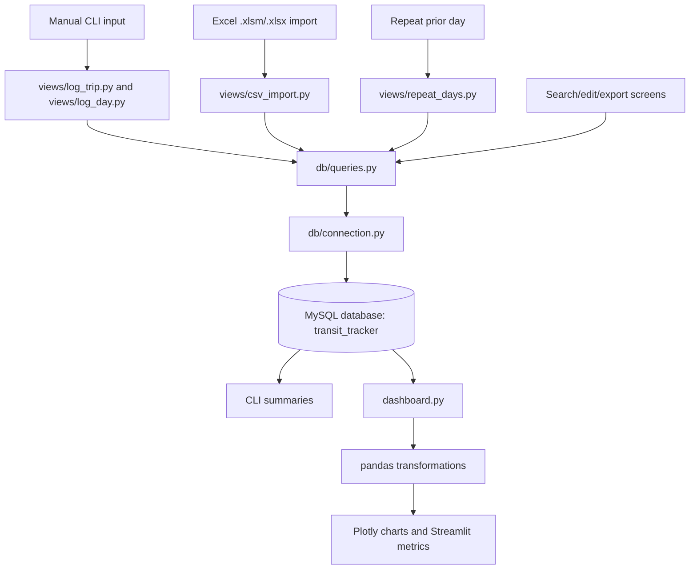

# Transit Tracker Project Report

## 1. Executive Summary

Transit Tracker is a personal public transport concession tracking application for Singapore. It records bus and train trips, stores them in MySQL, calculates spending against an $81 concession threshold, and exposes both a command-line workflow and a Streamlit analytics dashboard.

The problem it solves is practical cost visibility: a user who buys a monthly transit concession can see whether actual trips justify the concession price, which routes and modes dominate usage, and how spending trends over time.

In simple architecture terms, this is a small analytics application:

```text
User input / Excel import
        |
        v
Python CLI screens in views/
        |
        v
Database access layer in db/
        |
        v
MySQL trips table
        |
        v
CLI summaries + Streamlit dashboard
```

Interview positioning: this project is best described as a lightweight end-to-end data application. It includes ingestion from manual entry and Excel, normalized relational storage, SQL-based summary queries, Python transformation logic, CSV export, and a BI-style dashboard built with pandas, Plotly, and Streamlit.

## 2. Project Goals

Functional goals:

- Log single transit trips with transport mode, origin, destination, fare, and date.
- Log a full day of trips before saving them in bulk.
- Repeat a previous day's trips across one or more new dates.
- Search, edit, delete, export, and import trip records.
- Track current concession-cycle progress against an $81 threshold.
- Provide dashboard summaries, charts, route rankings, and raw-data inspection.

Data engineering goals:

- Centralize trip records in a relational database instead of spreadsheets.
- Keep inserts parameterized and reusable through a database access layer.
- Support bulk loading from Excel workbooks.
- Provide analytical aggregations by month, cycle, mode, day, route, and year.
- Separate ingestion, persistence, query, and serving concerns into modules.

Analytics goals:

- Identify whether the concession pass is financially worthwhile.
- Track total spend, total trips, bus/train split, monthly performance, and year-over-year movement.
- Surface frequently used routes and average route fares.

## 3. Repository Structure

Main repository contents:

```text
transit-concession-tracker/
  README.md
  PROJECT_REPORT.md
  config.py
  main.py
  utils.py
  setup.sql
  run.bat.example
  dashboard.py
  db/
    connection.py
    queries.py
    __init__.py
  views/
    log_trip.py
    log_day.py
    repeat_days.py
    monthly.py
    history.py
    search.py
    edit_trip.py
    export.py
    csv_import.py
    __init__.py
  build/
  dist/
  .venv/
  .env
  .gitignore
```

Important files and folders:

- `README.md`: setup instructions, features, tech stack, and expected Excel import structure.
- `config.py`: loads `.env`, defines `DB_CONFIG`, `CONCESSION_THRESHOLD`, `APP_TITLE`, and `MONTHS`.
- `main.py`: CLI entrypoint and menu router.
- `utils.py`: shared UI, date, concession-cycle, table, confirmation, fuzzy-location, and escape helpers.
- `setup.sql`: MySQL DDL and local database/user setup script.
- `db/connection.py`: MySQL connection and schema initialization.
- `db/queries.py`: all database query and mutation functions used by the app.
- `views/`: command-line screens for logging, importing, searching, editing, summarizing, and exporting trips.
- `dashboard.py`: Streamlit serving layer for analytics and visualization.
- `run.bat.example`: Windows launcher template for CLI or dashboard mode.
- `build/` and `dist/`: generated PyInstaller packaging artifacts. `dist/EZ-Track.exe` is a built executable.
- `.env`: local credentials file. It is correctly ignored by `.gitignore`.

## 4. High-Level Architecture

The application follows a simple layered design.



Layers:

- Source layer: manual CLI entries and Excel workbook imports.
- Ingestion layer: `views/log_trip.py`, `views/log_day.py`, `views/repeat_days.py`, and `views/csv_import.py`.
- Raw/operational storage: MySQL `trips` table.
- Query layer: `db/queries.py` provides parameterized SQL operations.
- Transformation layer: SQL aggregations in `db/queries.py` plus pandas groupby logic in `dashboard.py`.
- Serving layer: CLI summaries and Streamlit dashboard.
- Export layer: `views/export.py` writes selected trips to CSV.

## 5. Data Sources

There are no external web APIs in this repository. The data sources are user-controlled:

1. Manual command-line entry.
   - Screen: `views/log_trip.py`.
   - Fields: mode of transport, starting location, ending location, fare, and date.
   - Authentication: none beyond the local database connection.

2. Full-day command-line entry.
   - Screen: `views/log_day.py`.
   - The user builds an in-memory list of trips, previews it, and bulk-inserts the day.

3. Repeat prior day.
   - Screen: `views/repeat_days.py`.
   - Source data comes from existing database rows for a selected date.
   - Output is copied trip rows for one or more target dates.

4. Excel import.
   - Screen: `views/csv_import.py`.
   - Despite the function name `csv_import`, the implementation imports `.xlsm` and `.xlsx` files via `openpyxl`.
   - Expected sheet headers: `Mode of Transport`, `Starting Location`, `Ending Location`, `Total Price`, `Date`.
   - Skipped sheets: `data entry`, `summary`, `overview`, and `dashboard`.

Environment variables:

```text
DB_HOST
DB_USER
DB_PASSWORD
DB_NAME
DB_PORT
```

`config.py` defaults to host `localhost`, user `root`, empty password, database `transit_tracker`, and port `3306`.

## 6. API Extraction and Rate Limiting

This project does not implement API extraction. There are no HTTP clients, API endpoints, resource IDs, pagination loops, request retry policies, backoff functions, or rate-limiters in the codebase.

Equivalent ingestion constraints in this project:

- Excel import is local-file based and processes workbook sheets row by row.
- Bulk database insert uses `cursor.executemany()` in `insert_trips_bulk()`.
- There is no `max_records` or dev-mode cap.
- There is no timeout handling around MySQL operations.
- Response parsing fallback is present for Excel dates: `csv_import()` accepts both native `datetime` objects and string dates in `%Y-%m-%d` format.

Improvement opportunity: if this project later ingests live transit fares or card transactions from an API, it should add pagination, idempotent load keys, request retries with exponential backoff, and API-limit observability.

## 7. ETL / ELT Orchestration

The pipeline is orchestrated by simple Python scripts and interactive menu choices. It does not use Airflow, Dagster, Prefect, cron, or dbt.

Main entrypoint:

```bash
python main.py
```

Runtime sequence:

1. `main.py` calls `init_schema()` from `db.connection`.
2. `init_schema()` connects to MySQL without selecting a database, creates the configured database if needed, switches to it, and creates the `trips` table if needed.
3. `main_menu()` renders the CLI menu.
4. The selected view collects user input or reads an Excel file.
5. The view calls functions in `db.queries`.
6. `db.queries` writes to or reads from MySQL.
7. CLI screens format results into tables and summaries.
8. `dashboard.py`, when run separately through Streamlit, reads the same `trips` table and builds analytics views.

ETL/ELT framing:

- Extract: user input or Excel workbook rows.
- Transform: date parsing, mode normalization, fare conversion, fuzzy location matching, cycle calculation, aggregation.
- Load: parameterized inserts into MySQL.
- Serve: CLI summaries, CSV export, and Streamlit dashboard.

## 8. Core Modules and Functions

### `config.py`

Purpose: central configuration.

Key objects:

- `DB_CONFIG`: MySQL connection dictionary built from environment variables.
- `CONCESSION_THRESHOLD`: fixed threshold of `81.00`.
- `APP_TITLE`: application title.
- `MONTHS`: index-aligned month-name list where `MONTHS[1] == "January"`.

Inputs: `.env` values through `python-dotenv`.

Outputs: constants imported throughout the app.

### `main.py`

Purpose: CLI application bootstrap and menu routing.

Key functions:

- `main_menu()`: clears the screen, prints the header, current cycle status, recent trips, and menu options. Routes choices `1` through `9` to view functions and exits on `0`.

Important behavior:

- Calls `show_monthly_status()` and `show_recent_trips()` on each menu render.
- Catches `EscapeToMenu` to let users return from nested prompts.
- Calls `init_schema()` before showing the menu.

### `db/connection.py`

Purpose: database bootstrap and connection factory.

Key functions:

- `init_schema()`: creates the configured database and creates table `trips` if absent.
- `get_connection()`: returns a `mysql.connector.connect(**DB_CONFIG)` connection.

Inputs: `DB_CONFIG`.

Outputs: live MySQL connections and initialized schema.

Important behavior:

- Uses application-level schema creation, making local setup easier.
- The table created here does not include indexes, while `setup.sql` does include indexes. This difference is a schema consistency gap.

### `db/queries.py`

Purpose: persistence and analytics query layer.

Key write functions:

- `insert_trip(mode_of_transport, starting_location, ending_location, total_price, date)`: inserts one trip and returns the new ID.
- `insert_trips_bulk(trips)`: bulk-inserts trip tuples using `executemany()` and returns affected row count.
- `update_trip(trip_id, mode_of_transport, starting_location, ending_location, total_price, date)`: updates a row and returns whether a row changed.
- `delete_trip(trip_id)`: deletes a row and returns success as a boolean.

Key read functions:

- `get_trips_by_month(year, month)`: returns trips for one calendar month.
- `get_monthly_summary(year, month)`: returns monthly total, trip count, bus count, and train count.
- `get_all_locations()`: returns distinct origin and destination locations.
- `get_recent_days(limit=5)`: returns recent dates with trip count and total fare.
- `get_trips_by_date(trip_date)`: returns route rows for a date.
- `get_recent_routes(limit=5)`: returns recently used unique routes.
- `get_months_with_data()`: returns distinct year/month pairs.
- `search_trips(query="", mode="", start_date="", end_date="")`: dynamically filters trips by location, mode, and date range.
- `get_all_trips()`: returns all trips in ID order.
- `get_cycle_summary(start_date, end_date)`: returns concession-cycle totals and counts.
- `get_trips_by_cycle(start_date, end_date)`: returns trips for a concession cycle.
- `get_lifetime_summary()`: returns total spend, total trips, mode counts, first trip, and last trip.
- `get_recent_trips(limit=5)`: returns latest trips by ID.

Important behavior:

- SQL values are parameterized, reducing injection risk for user-provided filter values.
- `search_trips()` constructs dynamic `WHERE` clauses but keeps values in the parameter list.
- Aggregations are pushed into SQL where efficient, especially sums and counts.

### `utils.py`

Purpose: shared CLI helpers and domain calculations.

Key functions/classes:

- `clear()`: runs `cls` to clear the Windows terminal.
- `header()`: prints the app header.
- `show_monthly_status()`: computes current concession cycle and prints spend against threshold.
- `show_recent_trips()`: prints the last five trips.
- `draw_table(headers, rows)`: formats plain-text tables.
- `format_date_display(trip_date)`: formats dates as `Wed 01-07-2026` style strings.
- `collect_dates()`: collects multiple `DD-MM-YYYY` inputs and returns MySQL date strings.
- `confirm_prompt(message)`: yes/no confirmation helper.
- `find_similar_location(name, locations, threshold=0.8)`: uses `difflib.get_close_matches()` for fuzzy location suggestions.
- `EscapeToMenu`: custom control-flow exception.
- `check_escape(value)`: raises `EscapeToMenu` for `e`, `exit`, `quit`, or `q`.
- `get_current_cycle()`: calculates concession cycle from the 3rd of the current month to the 2nd of the next month.

### `views/log_trip.py`

Purpose: log one trip.

Key functions:

- `log_trip()`: shows recent routes, lets the user quick-log or manually enter a trip.
- `_quick_log(route)`: reuses a recent route and prompts only for date.
- `_manual_entry()`: validates mode, location, destination, fare, and date before inserting.
- `_get_date()`: parses optional date input.

Important behavior:

- Recent routes are sourced from `get_recent_routes()`.
- Location spelling suggestions use `find_similar_location()`.
- Prevents empty origin/destination and same origin/destination.
- Requires positive fare for single-trip manual entry.

### `views/log_day.py`

Purpose: build and save multiple trips for one date.

Key functions:

- `log_day()`: asks for a day, collects multiple trip tuples in memory, previews them, and bulk-inserts on confirmation.
- `_add_trip(locations)`: validates one trip and returns a tuple `(mode, origin, destination, total_price)`.

Important behavior:

- Supports add, delete-last, save, and cancel actions.
- Uses `insert_trips_bulk()` for efficient multi-row loading.
- Allows zero-dollar fares because it rejects only negative fares.

### `views/repeat_days.py`

Purpose: copy an existing day's trips to one or more new dates.

Key functions:

- `repeat_days()`: lists recent days, loads trips for the chosen date, collects target dates, previews the copy, and bulk-inserts duplicated rows.

Important behavior:

- Uses `get_recent_days()`, `get_trips_by_date()`, `collect_dates()`, and `insert_trips_bulk()`.
- Useful for recurring commute patterns.
- Does not deduplicate target dates or check whether trips already exist on those dates.

### `views/csv_import.py`

Purpose: import trip history from Excel.

Key functions:

- `csv_import()`: prompts for workbook path, validates extension, loads workbook with `openpyxl`, scans sheets, extracts rows, previews valid trips, reports skipped rows, and bulk-inserts.

Inputs:

- `.xlsm` or `.xlsx` workbook.

Outputs:

- Inserted trip rows in MySQL.

Important behavior:

- Ignores non-monthly sheets named `data entry`, `summary`, `overview`, or `dashboard`.
- Looks for a header row where the first cell equals `Mode of Transport`.
- Converts `"-"` fares to `0.0`.
- Accepts only modes `Bus` and `Train`.

### `views/monthly.py`

Purpose: current and historical concession-cycle summary screen.

Key functions:

- `monthly_summary()`: displays concession-cycle totals, trip counts, bus/train counts, favored mode, and trip rows.

Important behavior:

- Uses the project-specific cycle from day 3 to day 2, not a calendar month.
- Supports previous and next cycle navigation.
- The visible menu includes delete behavior, but the provided file ends after next-cycle logic and does not implement the `D` branch in the inspected source. This is a functionality gap.

### `views/history.py`

Purpose: all-month historical summary.

Key functions:

- `all_history()`: retrieves months with data and displays totals, concession profit/shortfall, counts, and favored mode.

Important behavior:

- Uses calendar months, while `monthly_summary()` uses concession cycles.
- Reads `CONCESSION_THRESHOLD` from config.

### `views/search.py`

Purpose: query trips interactively.

Key functions:

- `search()`: prompts for location keyword, transport mode, start date, and end date; displays matching rows and total fare.

Important behavior:

- Invalid dates are skipped rather than failing the whole search.
- Results come from `search_trips()`, capped at 100 rows.

### `views/edit_trip.py`

Purpose: update an existing trip.

Key functions:

- `edit_trip()`: searches trips, selects by ID, prompts for replacement values with defaults, previews before/after, and calls `update_trip()`.

Important behavior:

- Empty input preserves current value.
- Fare cannot be negative.
- Date must parse as `DD-MM-YYYY`.

### `views/export.py`

Purpose: export trips to CSV.

Key functions:

- `export()`: exports all trips, a specific month, or a specific year.

Outputs:

- CSV file with columns `Mode of Transport`, `Starting Location`, `Ending Location`, `Total Price`, and `Date`.

Important behavior:

- Defaults to `Desktop/transit_export.csv`.
- Creates parent directories if necessary.
- Uses `utf-8-sig` to make CSV output Excel-friendly.
- Specific-month export builds the end date as `YYYY-MM-31`, which works for string comparison in MySQL date filters but is not semantically valid for months with fewer than 31 days.

### `dashboard.py`

Purpose: Streamlit analytics and visualization layer.

Key functions:

- `get_current_cycle()`: duplicate cycle helper for dashboard.
- `load_all_trips()`: cached database extract into a pandas DataFrame.
- `load_lifetime_summary()`: cached call to `get_lifetime_summary()`.

Dashboard outputs:

- Current cycle metrics.
- Lifetime metrics.
- Selected period metrics.
- Monthly spending bar chart.
- Bus vs train pie chart.
- Daily spending bar chart.
- Top 10 route frequency chart with average fare.
- Year-over-year monthly spending line chart.
- Raw trip table.

Important behavior:

- Uses `@st.cache_data(ttl=60)` for short-lived dashboard caching.
- Converts MySQL row data into pandas date fields: `year`, `month`, `month_name`, and `day`.
- Uses Plotly Express and Graph Objects for visualizations.

## 9. Database Design

Database technology: MySQL via `mysql-connector-python`.

Primary database: `transit_tracker`.

Primary table: `trips`.

DDL from `setup.sql`:

```sql
CREATE TABLE IF NOT EXISTS TRIPS (
    id INT AUTO_INCREMENT PRIMARY KEY,
    mode_of_transport ENUM('Bus', 'Train') NOT NULL,
    starting_location VARCHAR(255) NOT NULL,
    ending_location VARCHAR(255) NOT NULL,
    total_price DECIMAL(10, 2) NOT NULL,
    date DATE NOT NULL,
    created_at TIMESTAMP DEFAULT CURRENT_TIMESTAMP,
    INDEX idx_date (date),
    INDEX idx_mode (mode_of_transport),
    INDEX idx_starting_location (starting_location),
    INDEX idx_ending_location (ending_location)
);
```

Table grain: one row per transit trip.

Column roles:

- `id`: surrogate primary key.
- `mode_of_transport`: constrained categorical value, either `Bus` or `Train`.
- `starting_location`: trip origin.
- `ending_location`: trip destination.
- `total_price`: fare amount as decimal currency.
- `date`: trip date.
- `created_at`: ingestion timestamp.

Indexes:

- `idx_date`: supports monthly, cycle, and date-range filtering.
- `idx_mode`: supports mode filters and bus/train analytics.
- `idx_starting_location` and `idx_ending_location`: support route and location lookups.

Design strengths:

- A single fact table is appropriate because the domain is simple and each trip has one clear grain.
- Monetary values are stored as `DECIMAL(10, 2)`, which is better than floating point for persisted currency.
- The `ENUM` constraint prevents invalid modes at the database layer.
- Date indexing supports the most common analytics patterns.

Design gaps:

- `db/connection.py` creates `trips` without the indexes included in `setup.sql`.
- There are no unique constraints or natural keys, so repeated imports can create duplicates.
- Locations are repeated strings rather than normalized dimension rows.
- No check constraint prevents negative fares in the database.
- Table casing differs between `setup.sql` (`TRIPS`) and application queries (`trips`). On Windows MySQL this may work case-insensitively, but it is less portable.

## 10. dbt / Transformation Layer

This repository does not include dbt. There is no `dbt_project.yml`, no `models/` folder, no `sources.yml`, and no dbt tests.

What transformation looks like instead:

- SQL aggregation functions in `db/queries.py`, such as `get_monthly_summary()`, `get_cycle_summary()`, and `get_lifetime_summary()`.
- pandas transformations in `dashboard.py`, such as monthly groupby, daily groupby, route groupby, and year-over-year grouping.

There are no dbt `source()` or `ref()` calls, staging models, marts, incremental models, materialized views, or dbt lineage graphs.

Equivalent lineage:

```text
Manual/Excel trip records
        |
        v
MySQL trips table
        |
        +--> SQL summaries in db/queries.py
        |
        +--> pandas DataFrame in dashboard.py
                 |
                 +--> monthly spend chart
                 +--> daily spend chart
                 +--> bus/train split
                 +--> top route ranking
                 +--> year-over-year trend
```

Materialized view explanation for interview context:

A materialized view is a stored result of a query. Unlike a normal view, which runs its SQL when queried, a materialized view persists precomputed rows and usually needs refresh logic. It is useful when dashboard queries are expensive or repeated often.

This project does not implement materialized views. If it grew into a warehouse-style architecture, good materialized candidates would be:

- `monthly_trip_summary`: one row per year/month with total fare and trip counts.
- `cycle_trip_summary`: one row per concession cycle.
- `route_summary`: one row per route/mode with count and average fare.

Expected refresh behavior would be after each import or on a scheduled basis. That would reduce dashboard compute, especially once the `trips` table becomes large.

## 11. Data Quality and Testing

There are no committed pytest tests, unittest files, dbt tests, or custom SQL test files in the inspected file list.

Observed verification run:

```bash
python -m compileall .
```

Expected outcome:

- Python recursively compiles all `.py` files to bytecode.
- Syntax errors fail the command.

Observed result:

- Passed. `compileall` successfully compiled `config.py`, `dashboard.py`, `db/connection.py`, `db/queries.py`, `main.py`, `utils.py`, and all files in `views/`.

What this proves:

- The checked Python files are syntactically valid.
- It does not prove runtime database connectivity, interactive flow correctness, dashboard rendering correctness, or query correctness against live data.

Application-level data quality checks:

- Mode validation restricts input to `Bus` or `Train`.
- Fare validation prevents negative fares in most interactive paths.
- Date parsing converts `DD-MM-YYYY` user input into MySQL `YYYY-MM-DD`.
- Excel import skips rows with invalid or unsupported modes.
- Empty origin/destination values are rejected in manual screens.
- `difflib.get_close_matches()` helps reduce spelling drift in location names.
- SQL `COALESCE()` protects summary totals from null sums.

Testing gaps:

- No automated unit tests for date parsing, cycle calculation, Excel import parsing, or query construction.
- No integration test with MySQL.
- No dashboard smoke test.
- No duplicate-load test for Excel import.
- No migration test comparing `setup.sql` and `init_schema()`.

## 12. Dashboard / API / Serving Layer

There is no HTTP API layer in this repository. Serving is split between the CLI and Streamlit.

CLI serving:

- `main.py` is the interactive command interface.
- `views/monthly.py` serves current and previous concession-cycle summaries.
- `views/history.py` serves all historical monthly summaries.
- `views/search.py` serves filtered trip lookups.
- `views/export.py` serves CSV extracts.

Dashboard serving:

```bash
streamlit run dashboard.py
```

Dashboard data source:

- Direct MySQL query against `trips` through `load_all_trips()`.
- Lifetime rollup through `get_lifetime_summary()`.

Caching:

- `load_all_trips()` uses `@st.cache_data(ttl=60)`.
- `load_lifetime_summary()` uses `@st.cache_data(ttl=60)`.
- This means dashboard data may be up to 60 seconds stale, trading immediacy for fewer database reads.

Filters and charts:

- Sidebar filters by year and month.
- Current cycle panel tracks spend against the concession threshold.
- Lifetime summary shows total spend, total saved, months covered, total trips, and average per month.
- Monthly spending chart compares spending with the $81 threshold.
- Bus vs train chart shows modal split.
- Daily spending chart shows day-level spend.
- Top routes chart ranks routes by count.
- Year-over-year line chart compares monthly totals across years.
- Raw data expander provides table-level detail.

## 13. Libraries and Tools

Dependency source: `README.md`. There is no `requirements.txt`, `pyproject.toml`, or lock file in the repository.

Data processing:

- `pandas`: transforms database rows into dashboard-ready DataFrames.
- `csv`: writes export files.
- `datetime`: parses and formats trip dates and concession cycles.
- `difflib`: fuzzy matching for similar location names.

Excel import:

- `openpyxl`: reads `.xlsm` and `.xlsx` workbooks.

Database:

- `mysql-connector-python`: connects to MySQL and executes parameterized SQL.

Configuration:

- `python-dotenv`: loads database credentials from `.env`.
- `os`: reads environment variables and clears the Windows terminal.
- `pathlib`: handles user-provided import/export file paths.

Dashboard/frontend:

- `streamlit`: dashboard app framework.
- `plotly.express`: concise chart creation.
- `plotly.graph_objects`: custom monthly spending bar chart and threshold overlays.

Testing/verification:

- `compileall`: standard-library syntax compilation used during this inspection.

Packaging:

- PyInstaller appears to have been used because `build/transit-tracker/` and `dist/EZ-Track.exe` are present.

## 14. Algorithms and Analytical Logic

Data engineering logic:

- Bulk insert: `insert_trips_bulk()` batches trip tuples with `executemany()` for full-day logging, repeated days, and Excel import.
- Dynamic filtering: `search_trips()` builds a conditional `WHERE` clause from optional location, mode, start-date, and end-date filters.
- Fuzzy matching: `find_similar_location()` uses edit-distance-like matching through `difflib.get_close_matches()` to suggest existing locations.
- Excel row parsing: `csv_import()` scans for a header row, skips non-data sheets, validates row shape, normalizes fares, and parses dates.
- Date normalization: manual inputs use `DD-MM-YYYY`; database storage uses `YYYY-MM-DD`.
- Cycle calculation: `get_current_cycle()` defines the concession period as the 3rd of the current month through the 2nd of the following month.

Analytical logic:

- Monthly aggregation: `get_monthly_summary()` groups by calendar month using `YEAR(date)` and `MONTH(date)`.
- Cycle aggregation: `get_cycle_summary()` filters date range from cycle start to cycle end.
- Lifetime aggregation: `get_lifetime_summary()` computes total spend, total trips, mode counts, and first/last trip.
- Route ranking: dashboard groups by route and mode, counts records, calculates average fare, sorts descending, and takes top 10.
- Bus/train split: dashboard uses `value_counts()` and SQL `SUM(CASE WHEN ...)`.
- Daily trend: dashboard groups by `day` and sums fares.
- Year-over-year trend: dashboard groups by `year` and `month`, then renders monthly totals as a line chart.

There is no machine learning or forecasting model in this codebase.

## 15. End-to-End Pipeline Walkthrough

### Local setup

Command:

```bash
python -m venv venv
venv\Scripts\activate
pip install mysql-connector-python python-dotenv openpyxl streamlit plotly pandas
```

Expected outcome:

- A local Python environment is created.
- Runtime dependencies are installed.

What this proves:

- The developer environment can run the CLI and dashboard dependencies.

### Database setup

Command:

```sql
-- Run in MySQL Workbench
source setup.sql;
```

Expected outcome:

- Database `transit_tracker` exists.
- Table `TRIPS` exists.
- Local user `transit_user` is created.
- CRUD privileges are granted.

What this proves:

- MySQL storage is ready for trip ingestion and analytics.

### CLI application

Command:

```bash
python main.py
```

Expected outcome:

- `init_schema()` initializes the database/table if possible.
- The CLI menu appears with current cycle status and recent trips.
- The user can log, search, edit, import, export, or summarize trips.

What this proves:

- The ingestion and operational workflows can run against MySQL.

### Excel import

Command/workflow:

```text
python main.py
Choose [9] Import from CSV
Enter full path to .xlsm or .xlsx workbook
Preview valid rows
Confirm import
```

Expected outcome:

- Valid workbook rows are inserted into `trips`.
- Skipped rows are reported.

What this proves:

- Historical spreadsheet data can be migrated into relational storage.

### Dashboard

Command:

```bash
streamlit run dashboard.py
```

Expected outcome:

- Browser opens the Streamlit dashboard.
- Metrics and charts render from MySQL trip records.

What this proves:

- Stored trip data can be served to an interactive analytics UI.

### CSV export

Command/workflow:

```text
python main.py
Choose [8] Export to CSV
Select all trips, month, or year
Confirm output path
```

Expected outcome:

- CSV file is written with selected trip rows.

What this proves:

- The application can produce portable extracts for Excel, backup, or sharing.

### Static validation

Command run during this report:

```bash
python -m compileall .
```

Expected outcome:

- All Python modules compile successfully.

Observed outcome:

- Passed.

What this proves:

- The source files are syntactically valid in the current Python environment.

## 16. Operational Considerations

Configuration:

- `.env` supplies MySQL settings.
- `.env` is ignored by `.gitignore`, which is correct for secrets.
- There is no `.env.example` in the inspected application folder even though the README instructs users to copy one.

Logging:

- The app uses terminal `print()` statements and Streamlit messages.
- There is no structured logging, log level control, or persistent audit trail.

Local development workflow:

- Install dependencies manually from README.
- Run MySQL setup with `setup.sql`.
- Start CLI with `python main.py`.
- Start dashboard with `streamlit run dashboard.py`.

Failure handling:

- `main.py` catches initial MySQL connection failure and exits with a user-facing message.
- `dashboard.py` catches MySQL load failures and stops the Streamlit app.
- Excel import catches workbook open and row parsing errors.
- Export catches permission errors and generic file-write exceptions.

Scalability:

- The single-table design is suitable for a personal tracker.
- Dashboard loads the whole `trips` table into pandas, which is fine for small data but less scalable for very large datasets.
- MySQL indexes in `setup.sql` support date and mode filtering, but `init_schema()` does not create those indexes.

Monitoring and alerting gaps:

- No job scheduler or pipeline monitor.
- No load-run metadata table.
- No alerting on failed imports or duplicate rows.
- No row-count reconciliation after Excel imports beyond the displayed inserted count.

## 17. Known Gaps and Improvement Opportunities

- Add `requirements.txt` or `pyproject.toml` so dependencies are reproducible.
- Add `.env.example` because the README references it but it was not present.
- Align `setup.sql` and `db/connection.py`; currently only `setup.sql` creates indexes.
- Decide on table casing consistently: `TRIPS` in `setup.sql` versus `trips` in Python.
- Add automated tests for `get_current_cycle()`, date parsing, Excel import parsing, query filters, and export paths.
- Add an integration-test strategy using a disposable MySQL database or container.
- Add duplicate detection for Excel imports and repeated days.
- Normalize locations into a dimension table if location quality becomes important.
- Add database constraints for non-negative fares.
- Fix encoding issues visible in several source files, where symbols appear as mojibake such as `✓`, `→`, and box-drawing characters.
- Complete or verify the delete-trip branch in `views/monthly.py`; the menu offers `[D] Delete trip`, but the inspected code does not show an implemented branch.
- Correct month export date handling in `views/export.py`; month end is built as `YYYY-MM-31` regardless of actual month length.
- Remove or ignore generated `build/` and `dist/` artifacts if they should not be versioned.
- Consider moving duplicated `get_current_cycle()` logic from `dashboard.py` into `utils.py`.
- Add structured logging for imports, exports, and database mutations.
- Add materialized summary tables or views only if data volume or dashboard latency requires it.

## 18. Interview Refresher

### "Tell me about this project."

"Transit Tracker is a personal analytics application for Singapore public transport concession usage. I built a Python CLI to log bus and train trips, stored each trip in MySQL, added Excel import and CSV export workflows, and built a Streamlit dashboard with pandas and Plotly to analyze spending, route patterns, and whether the monthly concession threshold was worth it."

### "What was the architecture?"

"It is a layered Python application. The `views/` folder handles CLI workflows, `db/queries.py` centralizes SQL reads and writes, `db/connection.py` manages MySQL connections and schema initialization, and `dashboard.py` serves analytics from the same MySQL `trips` fact table. The main data flow is input or Excel import, MySQL storage, SQL/pandas transformations, then CLI or dashboard serving."

### "How did you handle data quality?"

"I handled basic quality at ingestion: mode is limited to Bus or Train, dates are parsed into MySQL format, empty locations are rejected, fares are validated, and Excel imports skip invalid rows. I also used fuzzy matching with `difflib` to reduce duplicate location spelling variants. At the database level, the table uses an enum for mode and decimal for currency."

### "How did you use dbt?"

"This project does not use dbt. The transformation layer is implemented directly with SQL aggregation functions and pandas groupby logic. If I expanded it into an analytics engineering project, I would model `trips` as a raw source, create staging models for type cleanup and deduplication, then marts for monthly, cycle, and route summaries."

### "What is a materialized view and why did you use it?"

"A materialized view stores the result of a query so repeated dashboard reads do not recompute expensive aggregations each time. This project does not currently use materialized views because the data volume is small. If needed, I would add materialized monthly, cycle, and route summaries to improve dashboard performance."

### "How did you handle API limits?"

"There are no external APIs in this project, so there is no API rate limiting. The comparable ingestion concern is Excel and manual-entry loading. For bulk rows, I used `executemany()` to insert multiple trips efficiently. If I later integrated an API, I would add pagination, retries, exponential backoff, and idempotent load keys."

### "What would you improve?"

"I would add automated tests, a dependency lock file, a proper `.env.example`, duplicate detection for imports, consistent schema management, and structured logging. I would also align `setup.sql` with `init_schema()` so local initialization always creates the same indexed schema."

## 19. Expected Outcomes

### `python main.py`

Expected outcome:

- Connects to MySQL.
- Initializes database/table if possible.
- Opens the CLI menu.

What success looks like:

- No connection error appears.
- The menu displays current cycle status and options.

What this proves:

- Runtime configuration, MySQL connectivity, schema initialization, and CLI routing are working.

### `streamlit run dashboard.py`

Expected outcome:

- Starts a Streamlit server.
- Displays transit metrics and Plotly charts.

What success looks like:

- Dashboard loads without `Cannot connect to MySQL`.
- Metrics and charts match the data in `trips`.

What this proves:

- MySQL reads, pandas transformations, Streamlit rendering, and dashboard caching are functioning.

### Excel import workflow

Expected outcome:

- Workbook sheets are scanned.
- Valid rows are previewed.
- Confirmed rows are inserted.

What success looks like:

- The app reports the number of imported trips.
- Imported rows appear in history, search, and dashboard views.

What this proves:

- Local spreadsheet extraction and bulk load into MySQL are working.

### CSV export workflow

Expected outcome:

- Selected rows are written to a CSV.

What success looks like:

- File exists at the selected path.
- Excel can open it with the expected columns.

What this proves:

- Query filtering and outbound extract generation are working.

### `python -m compileall .`

Expected outcome:

- Python compiles all source files.

Observed result:

- Passed during inspection.

What this proves:

- The Python files have valid syntax.

## 20. Final Takeaway

Transit Tracker is strongest as an interview story about turning messy personal transit records into a structured analytics workflow. The technical value is the end-to-end path: ingestion from CLI and Excel, normalized storage in MySQL, reusable SQL access functions, analytical aggregation in SQL and pandas, and dashboard/CSV outputs.

The best framing is: "I built a practical data product around a real recurring decision: whether my transport concession pass pays off. It covers the core analytics-engineering loop: collect data, validate it, store it with a clear grain, transform it into useful metrics, and serve it back through an interface that supports decisions."

